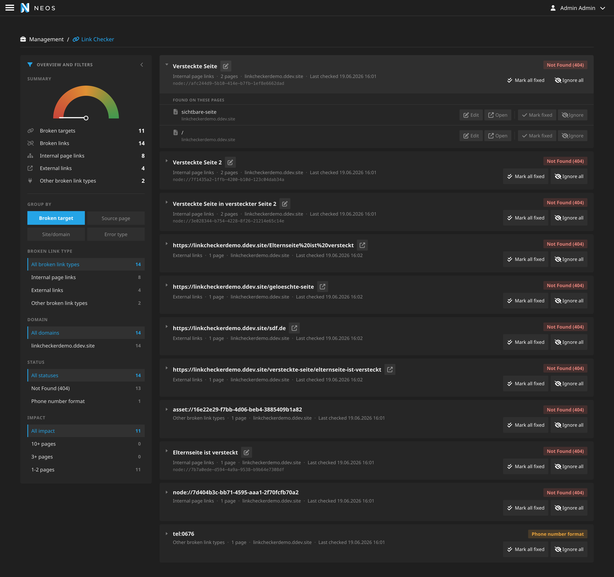

[](https://packagist.org/packages/neosidekick/linkchecker)
[](LICENSE)

# NEOSidekick.LinkChecker

## Keep your Neos website free of broken links with this easy-to-use link checker

NEOSidekick.LinkChecker makes sure all your links are working smoothly in Neos projects. It validates internal page and asset 
references, external links and phone numbers in node data, as well crawls all rendered pages to ensure that no hidden 
pages fall through the cracks!



The backend module allows you to mark errors as fixed and as to-be-ignored. Editing buttons directly open relevant pages
in the Neos inline editing to easily fix the issues.

The link checker has the following methods to find broken links:

 - The backend module can validate all internal page links `node://XXX` and assets `asset://XXX` in all node properties
   - Additionally, it validates phone numbers to be in international format (`+99 999999999`)
 - The command controller `./flow checklinks:crawl` will crawl all in the settings configured domains and pages and check the following:
   - Do all internal links `node://XXX` point to visible pages (not hidden, not hidden via visible before or visible after)
   - Are all phone numbers in international format (`+99 999999999`)
   - Do external links point to valid pages (http status code 2xx)
 - The command controller `./flow checklinks:crawlnodes` will only validate internal links, assets and phone numbers
 - The command controller `./flow checklinks:crawlexternallinks` will crawl the website and validate external links

## Installation

NEOSidekick.LinkChecker is available via packagist run `composer require neosidekick/linkchecker`.
We use semantic versioning so every breaking change will increase the major-version number.

### Upgrade from CodeQ.LinkChecker

This package replaces `codeq/linkchecker` and ships a Flow code migration for existing projects.

After changing the Composer dependency, run:

```bash
./flow flow:core:migrate Your.SitePackage --force
./flow doctrine:migrate
```

The code migration updates PHP namespaces, package keys, Fusion references, command identifiers and settings paths from
`CodeQ.LinkChecker` to `NEOSidekick.LinkChecker`. The Doctrine migration renames the persisted result table from
`codeq_linkchecker_domain_model_resultitem` to `neosidekick_linkchecker_domain_model_resultitem`.

## Usage

Configure the link checker sync in your settings, like this:

```yaml
NEOSidekick:
  LinkChecker:
    # how many concurrent requests should the command controller perform
    # If set too high, you will DDoS your server
    concurrency: 10
```

Make sure the domains are also added in the "Sites Management"!

Setup a cronjob e.g. daily to execute `./flow checklinks:crawl`.

### Backend module crawl queue

The backend module starts crawls through `Flowpack.JobQueue.Common`. The package ships a 
Doctrine-backed queue named `NEOSidekick.LinkChecker.Crawl` and stores its messages in the table
`neosidekick_linkchecker_jobqueue_crawl`. When the worker starts a backend-triggered crawl, it first
removes all non-ignored previous findings and then runs the normal crawl command.

After installing the package, initialize the queue once:

```bash
./flow flowpack.jobqueue.common:queue:setup NEOSidekick.LinkChecker.Crawl
```

You can verify the queue configuration with:

```bash
./flow flowpack.jobqueue.common:queue:list
./flow flowpack.jobqueue.common:queue:describe NEOSidekick.LinkChecker.Crawl
```

Run a worker for the crawl queue:

```bash
./flow flowpack.jobqueue.common:job:work NEOSidekick.LinkChecker.Crawl --verbose
```

For production, run the worker under a process supervisor such as systemd, supervisord or your
container platform. The worker should be restarted if it exits. A minimal systemd service looks like:

```ini
[Unit]
Description=NEOSidekick LinkChecker crawl worker
After=network.target

[Service]
Type=simple
WorkingDirectory=/var/www/html
ExecStart=/var/www/html/flow flowpack.jobqueue.common:job:work NEOSidekick.LinkChecker.Crawl --verbose
Restart=always
RestartSec=5
User=www-data

[Install]
WantedBy=multi-user.target
```

If you cannot run a permanent worker, run short-lived workers from cron:

```cron
* * * * * cd /var/www/html && ./flow flowpack.jobqueue.common:job:work NEOSidekick.LinkChecker.Crawl --exit-after 55
```

Inspect queued jobs and failed messages with:

```bash
./flow flowpack.jobqueue.common:job:list NEOSidekick.LinkChecker.Crawl --limit 10
./flow flowpack.jobqueue.common:queue:list
```

With the default Doctrine queue, operators can also inspect the queue table directly:

```sql
SELECT state, COUNT(*) FROM neosidekick_linkchecker_jobqueue_crawl GROUP BY state;
SELECT id, state, failures, scheduled FROM neosidekick_linkchecker_jobqueue_crawl ORDER BY id;
```

Successful jobs are removed from the table. Failed jobs remain with `state = 'failed'`.

Projects that already use another JobQueue backend can override only this queue. For example, to use
Redis instead of Doctrine:

```yaml
Flowpack:
  JobQueue:
    Common:
      queues:
        'NEOSidekick.LinkChecker.Crawl':
          className: 'Flowpack\JobQueue\Redis\Queue\RedisQueue'
          options:
            client:
              host: 127.0.0.1
              port: 6379
```

### Reducing false positives

Not every non-2xx response means a link is dead. To keep the report trustworthy, findings are
classified into two states:

 - **broken**: genuinely dead links (`404`, `410`, other `4xx`/`5xx`, missing `node://`/`asset://`
   targets). Only these trigger email notifications and lower the health score.
 - **warning**: results that cannot be verified and should not be treated as errors — auth walls
   (`401`), bot blocks (`403`), rate limiting (`429`), Cloudflare bot challenges, hosts that are
   known to block crawlers, unfollowed redirects and invalid phone number formats.

The checker also follows redirects (so a `301`/`302` to a working page is no longer reported),
retries only transient failures (timeouts, `429`, `502`–`504`) with exponential backoff while
honoring `Retry-After`, and sends an honest, configurable `User-Agent`.

All of this is configurable:

```yaml
NEOSidekick:
  LinkChecker:
    # Regex rules (full patterns incl. delimiters) that suppress matching findings entirely.
    # Each entry is either a pattern string or {pattern: '/.../', statusCodes: [404]}.
    ignoreRules:
      - '#^https://intranet\.example\.com/#'

    classification:
      # Status codes that are reported as warnings instead of broken links.
      treatAsWarning: [401, 403, 429]
      # Treat Cloudflare bot challenges (cf-mitigated / cf-ray headers) as warnings.
      detectCloudflareChallenge: true
      # Hosts that routinely block crawlers; findings for these are downgraded to warnings.
      knownBlockerDomains:
        - 'linkedin.com'
        - 'x.com'

    clientOptions:
      # Follow redirects so a 301/302 to a working page is not reported as broken.
      allowRedirects: true
      maxRedirects: 5
      # Some servers block the default Guzzle user agent.
      userAgent: 'NEOSidekickLinkChecker/1.0 (+https://neosidekick.com/)'
```

### Performance & scale

External link checks are the slow part of a crawl. Several measures keep crawls fast and polite:

 - **HEAD-first**: external links only need their status, so they are checked with a cheap `HEAD`
   request (with an automatic `GET` fallback for servers that reject `HEAD`). Internal pages still
   use `GET` because their body is needed to discover links.
 - **Byte cap**: external requests carry a `Range` header and the body read is capped, so a link to
   a huge PDF or video is never fully downloaded.
 - **Per-host rate limiting**: external hosts are limited to a few requests per second; the site's
   own host is governed by `concurrency`. Connections are kept alive and reused.
 - **In-run deduplication**: each unique URL is checked once per crawl, even if it appears on many
   pages (e.g. navigation/footer links).
 - **Between-run cache** (opt-in): external links confirmed healthy can be skipped on the next run
   until the cached result expires.
 - **Incremental internal crawl** (opt-in, `./flow checklinks:crawl --only-changed`): only re-checks
   content nodes modified since the last run. Note this can miss links broken by changes on the
   *target* side, so it is best combined with periodic full crawls.

```yaml
NEOSidekick:
  LinkChecker:
    performance:
      maximumResponseSize: 2097152     # max body bytes read per page
      headFirst: true
      externalRangeBytes: 65536        # Range: bytes=0-N for external requests (0 = off)
      perHostRequestsPerSecond: 4      # 0 = no per-host limit
      betweenRunCache:
        enabled: false
        okLifetime: 604800             # seconds a healthy external link may be skipped
    incremental:
      enabled: false                   # or pass --only-changed per run
```

### Email reports

The link checker can also send an email if it finds broken links.
To enable this, you need to configure the email service like this:

```yaml
NEOSidekick:
  LinkChecker:
    notifications:
      enabled: true
      subject: 'Link checker results'
      minimumStatusCode: 300
      mail:
        sender:
          default:
            name: 'Link Checker'
            address: 'no-reply@example.com'
        recipient:
          default:
            name: 'John Doe'
            address: 'recipient@example.com'
        ccRecipient:
          default:
            name: 'Client'
            address: 'client@example.com'
```

## Limitations and possible future Features:
 - Support additional languages
 - Update the link checks after a page is published via a job queue
 - Check external links against malware oder security adviser lists
 - Find all occurrences of external links to internal pages
 - Check against deny list (e.g. list of competitors)
 - Check for broken links in other workspaces

## License

The GNU GENERAL PUBLIC LICENSE, please see [License File](LICENSE) for more information.

## Sponsors & Contribution

The development of this plugin was kindly sponsored by [Code Q](https://codeq.at/). 

The package is based on the `Unikka/LinkChecker` package, which does a great job at finding all broken external links. This package extends the features a lot, offers a new UI and introduces new dependencies.

We will gladly accept contributions. Please send us pull requests.

## Tests

Run the unit tests from the project root inside DDEV:

```bash
ddev exec ./bin/phpunit --configuration UnitTests.xml DistributionPackages/NEOSidekick.LinkChecker/Tests/Unit
```

Alternatively, run the package-local PHPUnit configuration:

```bash
ddev exec ./bin/phpunit --configuration DistributionPackages/NEOSidekick.LinkChecker/Tests/UnitTests.xml
```
